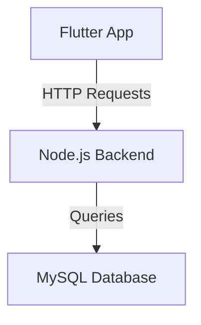

# Gestion des Utilisateurs - Flutter & MySQL avec Authentification

Ce projet ajoute un système d'authentification utilisateur à une application Flutter connectée à une base de données MySQL à l’aide d’un backend Node.js. L'objectif est de gérer des connexions sécurisées et d'assurer une gestion complète des utilisateurs.

## 📋 Fonctionnalités
- **Authentification** avec email et mot de passe.
- **Récupération et gestion des utilisateurs** depuis une base MySQL.
- **Ajout d'utilisateurs** avec nom, email, téléphone et mot de passe.
- Hashage des mots de passe pour une meilleure sécurité.
- Backend développé avec Node.js et Express.

---

## 📁 Structure du Projet
```
flutter_mysql_project/
├── backend/              # Backend Node.js
│   ├── server.js
│   ├── package.json
│   ├── node_modules/
│   └── ...
├── frontend/             # Application Flutter
│   ├── lib/
│   ├── pubspec.yaml
│   ├── add_user.dart
│   └── ...
```

---

## ⚙️ Configuration

### Prérequis
- [Node.js](https://nodejs.org/) installé.
- [Flutter](https://flutter.dev/) installé et configuré.
- Serveur MySQL fonctionnel.
- Le premier TP de réalisé sur la machine.

### 1. Mise à jour de la base de données
Ajoutez le champ `password` dans la table `users` pour gérer l'authentification.

```sql
ALTER TABLE users ADD COLUMN password VARCHAR(255) NOT NULL AFTER email;

-- Exemple pour mettre à jour les utilisateurs existants
UPDATE users
SET password = SHA2('motdepasse', 256)
WHERE email = 'exemple@domain.com';
```

### 2. Backend
1. **Installer les nouvelles dépendances** :
   ```bash
   cd backend
   npm install bcryptjs jsonwebtoken body-parser
   ```

2. **Mise à jour du serveur Node.js** :
   - Ajoutez une route `/api/login` pour gérer l'authentification.
   - Assurez-vous que les mots de passe sont comparés avec `bcrypt`.

3. **Lancer le serveur** :
   ```bash
   node server.js
   ```

### 3. Frontend
1. **Mise à jour des fichiers Flutter** :
   - Créez un nouvel écran d'authentification (fichier `main.dart`).
   - Ajoutez la gestion des mots de passe dans `api_service.dart`.
   - Créez un nouvel écran pour l'ajout des utilisateurs après connexion (`add_user.dart`).

2. **Installation des dépendances** :
   ```bash
   cd frontend
   flutter pub get
   ```

3. **Lancer l’application Flutter** :
   ```bash
   flutter run
   ```

---

## 🖥️ Fonctionnement de l’Application

### Écran d'authentification
- Champ email et mot de passe pour se connecter.
- Gestion des erreurs (utilisateur inexistant, mot de passe incorrect, etc.).
- Redirection vers l'écran de gestion des utilisateurs après connexion réussie.

### Ajout des utilisateurs
- Ajout des utilisateurs avec nom, email, téléphone et mot de passe.
- Hashage des mots de passe avant enregistrement en base.

---

## 📜 Schéma d'Architecture



---

## 📌 Critères remplis
1. **Authentification complète** :
   - Validation des identifiants utilisateur (email et mot de passe).
   - Messages d'erreur en cas de connexion échouée.

2. **Endpoints fonctionnels** :
   - `/api/login` : Authentification.
   - `/api/utilisateurs` : Gestion des utilisateurs.

3. **Robustesse et sécurité** :
   - Hashage des mots de passe avec `bcrypt`.
   - Validation des données.

4. **Affichage et navigation Flutter** :
   - Écran d'authentification.
   - Redirection après connexion.

---

## 📷 Captures d’écran (Impossible de le finir pour l'instant, donc aucune capture d'écran possible.)

<!-- --- -->

## 🚀 Améliorations possibles
- Ajouter une gestion des tokens JWT pour les sessions.
- Mettre en place un écran pour modifier ou supprimer les utilisateurs.
- Gérer les rôles utilisateurs pour différencier les droits.