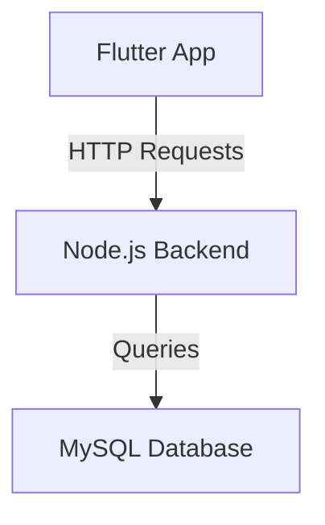

# Gestion des Utilisateurs - Flutter & MySQL

Ce projet consiste à développer une application Flutter connectée à une base de données MySQL à l’aide d’un backend Node.js. L’objectif est de manipuler et afficher dynamiquement des données d’utilisateurs.

## 📋 Fonctionnalités
- **Récupération des utilisateurs** depuis la base de données MySQL.
- **Ajout de nouveaux utilisateurs** avec nom, email et téléphone.
- Affichage des données dans une interface Flutter.
- Backend développé avec Node.js et Express.

---

## 📁 Structure du Projet
```
flutter_mysql_project/
├── backend/              # Backend Node.js
│   ├── server.js
│   ├── package.json
│   └── node_modules/
├── frontend/             # Application Flutter
│   ├── lib/
│   ├── pubspec.yaml
│   └── ...
```

---

## ⚙️ Configuration

### Prérequis
- [Node.js](https://nodejs.org/) installé.
- [Flutter](https://flutter.dev/) installé et configuré.
- Serveur MySQL fonctionnel.

### 1. Backend
1. **Installation des dépendances :**
   ```bash
   cd backend
   npm install
   ```
2. **Configuration de la base de données :**
   - Créez la base de données et la table dans MySQL :
     ```sql
     CREATE DATABASE gestion_utilisateurs;

     USE gestion_utilisateurs;

     CREATE TABLE users (
         id INT AUTO_INCREMENT PRIMARY KEY,
         nom VARCHAR(50),
         email VARCHAR(50),
         phone VARCHAR(20)
     );

     INSERT INTO users (nom, email, phone) VALUES
     ('Alice Dupont', 'alice@example.com', '0612345678'),
     ('Bob Martin', 'bob@example.com', '0678901234');
     ```
   - Mettez à jour les informations de connexion MySQL dans `server.js` :
     ```javascript
     const connection = mysql.createConnection({
         host: '127.0.0.1',
         user: 'root',
         password: 'votre_mot_de_passe',
         database: 'gestion_utilisateurs'
     });
     ```

3. **Lancer le serveur backend :**
   ```bash
   node server.js
   ```

### 2. Frontend
1. **Installation des dépendances :**
   ```bash
   cd frontend
   flutter pub get
   ```

2. **Lancer l’application Flutter :**
   ```bash
   flutter run
   ```

---

## 🖥️ Fonctionnement de l’Application

### Écran principal
- Liste des utilisateurs récupérés depuis la base MySQL.
- Formulaire permettant d’ajouter un nouvel utilisateur avec son **nom**, **email** et **téléphone**.

### Ajouter un utilisateur
1. Remplissez le formulaire avec les informations de l’utilisateur.
2. Cliquez sur **"Ajouter un utilisateur"**.
3. L’utilisateur est ajouté à la base MySQL, et la liste se met à jour automatiquement.

---

## 📜 Schéma d'Architecture



---

## 📌 Critères remplis
1. **Endpoints fonctionnels :**
   - Récupération des données : `/api/utilisateurs`.
   - Ajout d’un utilisateur : `/api/utilisateurs`.

2. **Affichage des données dans Flutter :**
   - Liste dynamique et mise à jour en temps réel.

3. **Robustesse et gestion des erreurs :**
   - Messages d’erreur en cas de problème de connexion.
   - Gestion des champs vides avant l’ajout.

4. **Rapport complet :**
   - Documentation claire dans ce README.
   - Explications des étapes et schéma d’architecture.

---

## 📷 Captures d’écran

### Liste des utilisateurs
_À faire : Ajoutez une capture d’écran ici._

### Ajout d’un utilisateur
_À faire : Ajoutez une capture d’écran ici._

---

## 🚀 Améliorations possibles
- Ajouter la possibilité de modifier ou supprimer un utilisateur.
- Gestion de la pagination pour les grandes bases de données.
- Sécuriser l’API avec des tokens d’authentification.

---

N’hésitez pas à cloner le repo et tester ce projet. Si vous avez des questions ou des suggestions, ouvrez une **issue** !
